<p align="center">
  
</p>

## 🐟 About

ゲームクリエイター / ゲーム UX エンジニア。ゲームの“おもしろさ”を追求しています。

```yaml
role:        [ game UX engineer, GameCreator, Unityの講師 ]
focus:       ゲームの“おもしろさ” / ゲーム体験 / 触り心地 / UIアニメーション
main_engine: Unity
motto:       "技術力でみんなをワクワクさせる！"
```

## 🌊 Website

つくったゲーム・技術ブログをこちらにまとめています。

<p align="center">
  <a href="https://sabanogames.com">
    
  </a>
</p>

<p align="center">
  <em>ゲームの「おもしろい」を、つくって・あそんで・ことばにする。</em><br/>
  <a href="https://sabanogames.com">🌊 sabanogames.com</a>
</p>

## 🔗 Links

<p align="center">
  <a href="https://qiita.com/saba383810"></a>
  <a href="https://x.com/saba383810"></a>
</p>
